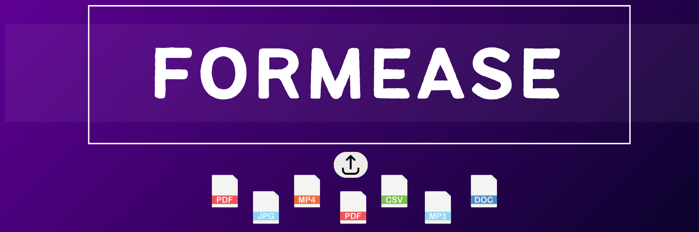

<p align="center">

</p>


<h3 align="center">One-Click File Processing for Seamless Online Applications</h3>

---

##  Project Overview

**FormEase** is a lightweight Chrome Extension that streamlines the file upload process for online application forms.  
Users can **resize, compress, and convert images or videos** directly inside any webpage — without needing external tools.

> Built for privacy, designed for accessibility, and crafted to reduce friction in applications.


<p align="center">
  
  
  
  
</p>


##  Tech Stack

| Component          | Tool / Library        |
|--------------------|-----------------------|
| Extension Framework | Chrome Extension (Manifest V3) |
| Scripting Language | JavaScript            |
| UI Styling         | HTML, TailwindCSS     |
| Image Processing   | [Pica.js]             |
| Video Processing   | [ffmpeg.wasm]         |
| File Handling      | FileReader, DataTransfer APIs |
---

## Directory Structure

```bash
OSOC-25-FORMEASE/
├── .github/
│   ├── Code_of_conduct.MD         # Community rules & guidelines
│   └── Contributing.md            # Contribution process & etiquette
├── formease.png                   # Logo/image for README or branding
├── icons/                         # (Currently empty — add icons like logo.png here)
├── scripts/
│   ├── compress.js                # Handles file compression logic
│   ├── convert.js                 # Handles file format conversion
│   ├── ffmpeg.min.js              # External library for video/audio processing
│   ├── pica.min.js                # External library for image resizing
│   └── resize.js                  # Logic for resizing images
├── content.js                     # Injects toolbox into webpages with file inputs
├── LICENSE                        # Licensing information (MIT, etc.)
├── manifest.json                  # Chrome extension config & permissions
├── README.md                      # Main documentation with project overview
├── styles.css                     # Toolbox and component styles
├── toolbox.html                   # Floating UI element with buttons and sliders


```
---

## Installation & Testing

1. Clone the repository  
2. Open `chrome://extensions` in your browser  
3. Enable **Developer Mode**  
4. Click **"Load Unpacked"** → select the `formease-extension/` folder  
5. Visit any page with a file upload input to test the extension  

---

## Contributing

- Explore issues and choose your interests
- Check our [CONTRIBUTING.md](./CONTRIBUTING.md) for full setup & PR flow, as well as [Code of Conduct](./.github/Code_of_conduct.md)
- Build real features, learn web tech, and improve user experience!
  

## Project Mentors

<p align="center">
  
  &nbsp;&nbsp;&nbsp;&nbsp;&nbsp;&nbsp;
</p>

<p align="center">
  <strong>Somya Vats</strong> &nbsp;&nbsp;&nbsp;&nbsp;&nbsp;&nbsp;
</p>

<p align="center">
  <a href="https://github.com/vatssomya">
    
  <a href="https://www.linkedin.com/in/somya-vats-472a4a289/">
    
  </a>
  &nbsp;&nbsp;&nbsp;&nbsp;
  
</p>

---
---

## 🌱  Message to Contributors

Whether you're writing your first line of JavaScript or experimenting with browser APIs, you're welcome here. **FormEase** was born from the need to solve a real-world pain in a lightweight, privacy-friendly way . It's powered by people like you who are curious, bold, and eager to learn.

If you’ve ever hesitated to contribute to open source, let this project be your safe space to try, fail, learn, and grow.

And hey! I’m also learning and building this project with you, so feel free to suggest better approaches.

Together, let’s build something useful, beautiful, and beginner-friendly — one line at a time.

---

<p align="center"><strong>FormEase – One Tab, Fewer Hassles.</strong></p>

---
